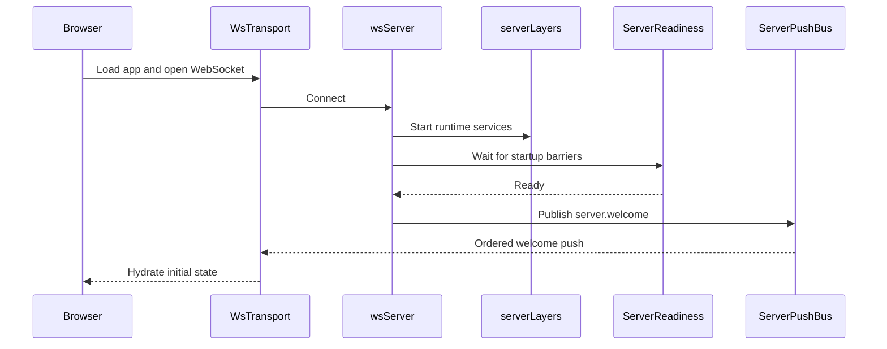
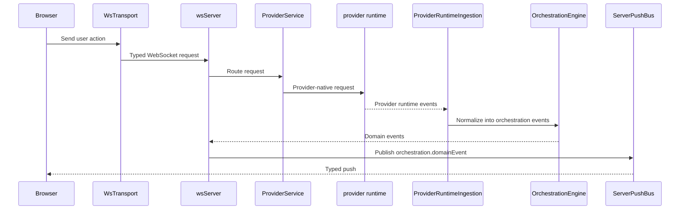
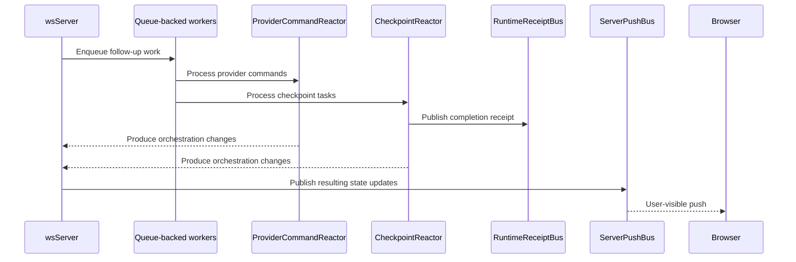

# Architecture

T3 Code runs as a Node.js WebSocket server that serves a React web app and brokers multiple provider runtimes behind a shared orchestration layer.

```
┌─────────────────────────────────┐
│  Browser (React + Vite)         │
│  wsTransport (state machine)    │
│  Typed push decode at boundary  │
└──────────┬──────────────────────┘
           │ ws://localhost:3773
┌──────────▼──────────────────────┐
│  apps/server (Node.js)          │
│  WebSocket + HTTP static server │
│  ServerPushBus (ordered pushes) │
│  ServerReadiness (startup gate) │
│  OrchestrationEngine            │
│  ProviderService                │
│  CheckpointReactor              │
│  RuntimeReceiptBus              │
└──────────┬──────────────────────┘
           │ provider-specific transport
┌──────────▼──────────────────────┐
│  Provider runtimes              │
│  - codex app-server (stdio)     │
│  - OpenCode sidecar (HTTP/SSE)  │
└─────────────────────────────────┘
```

## Components

- Browser app: the React app renders session state, owns the client-side WebSocket transport, and treats typed push events as the boundary between server runtime details and UI state.
- Server: `apps/server` serves the web app, accepts WebSocket requests, waits for startup readiness before welcoming clients, and sends outbound pushes through a single ordered path.
- Provider runtimes: the server owns provider-specific adapters. Codex uses `codex app-server` over JSON-RPC stdio. OpenCode uses a pooled local sidecar started from `opencode serve` and accessed through the OpenCode SDK plus HTTP/SSE.
- Background workers: long-running flows such as runtime ingestion, command reaction, and checkpoint processing run as queue-backed workers to keep side effects ordered and test synchronization deterministic.
- Runtime signals: the server emits typed receipts when async milestones finish, such as checkpoint capture or turn quiescence, so tests and orchestration code can wait on explicit signals instead of polling.

## Event Lifecycle

### Startup and client connect



1. The browser boots `WsTransport` and registers typed listeners in `wsNativeApi`.
2. The server accepts the connection in `wsServer` and brings up the runtime graph from `serverLayers`.
3. `ServerReadiness` waits until the key startup barriers are complete.
4. Once ready, `wsServer` sends `server.welcome` through `ServerPushBus`.
5. The browser receives that ordered push and hydrates local state.

### User turn flow



1. A user action in the browser becomes a typed request through `WsTransport` and the browser `NativeApi` layer.
2. `wsServer` decodes that request using the shared contracts and routes it to the right service.
3. `ProviderService` starts or resumes a provider session through the selected adapter.
4. Provider-native events are pulled back into the server by `ProviderRuntimeIngestion`, which converts them into orchestration events.
5. `OrchestrationEngine` persists those events, updates the read model, and exposes them as domain events.
6. `wsServer` pushes those updates to the browser through `ServerPushBus`.

OpenCode-specific note:

- `OpenCodeAdapter` translates OpenCode session, message, tool, permission, and question events into canonical runtime events before orchestration sees them.
- T3 persists the OpenCode session binding so recovered threads can resume against the public OpenCode session APIs instead of depending on transient callback state.
- Pending approvals and pending user-input questions now flow through the same web session model as other providers, including multi-select and custom-answer question variants.

### Async completion flow



1. Some work continues after the initial request returns, especially in `ProviderRuntimeIngestion`, `ProviderCommandReactor`, and `CheckpointReactor`.
2. These flows run as queue-backed workers using `DrainableWorker` so side effects stay ordered and test synchronization remains deterministic.
3. When a milestone completes, the server emits a typed receipt on `RuntimeReceiptBus`.
4. Tests and orchestration code wait on those receipts instead of polling git state, projections, or timers.
5. Any user-visible state changes produced by that async work still go back through `wsServer` and `ServerPushBus`.
